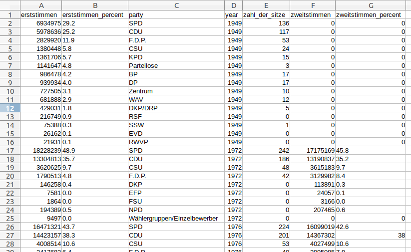

# Bundestagswahl_History_Scraper
This Scrapy-project can be used to extract the historic vote results of the German federal elections (Bundestagswahlen) since 1949.

## Dependencies and installation
The only dependency of this project is Python 3 and Scrapy. See the official documentation to see how it is installed:
https://docs.scrapy.org/en/latest/intro/install.html

## Usage
To run the crawler and write the results into the file history.csv use:

    scrapy crawl buwahlhistory -o history.csv

## Notes
In the year 1949 there was only one vote (Erststimme). The rows for the second vote will be 0 in that year.

# Results
The results can be exported into various formats. Here is an example of the csv export:

